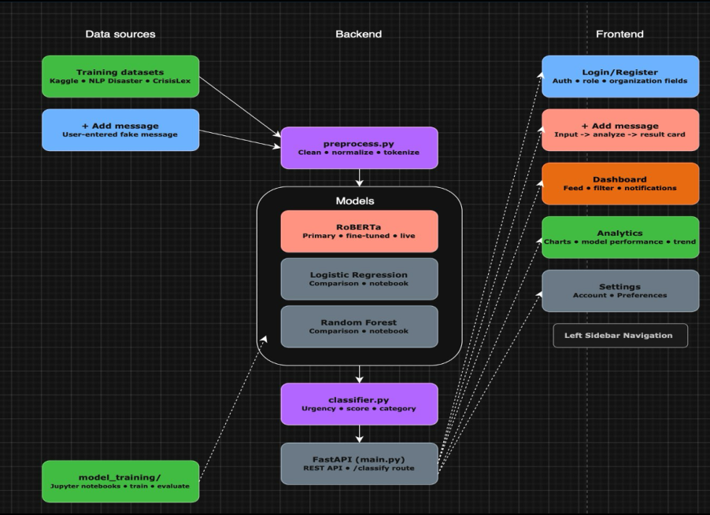

# RapidRelief – AI Emergency Message Prioritization

This repository documents my architecture and system-planning contributions to the RapidRelief AI emergency response project.

## Overview

RapidRelief is an AI-powered emergency message prioritization system that classifies and ranks emergency notifications based on urgency and category.

The project was designed to help dispatchers and emergency coordinators identify critical situations faster.

## My Role

I contributed primarily as:

- System Architect
- Data Flow Designer
- Backend Planning Support

## Contributions

My responsibilities included:

- Designing message-processing workflows
- Planning backend/frontend communication structure
- Defining AI classification data flow
- Structuring interactions between frontend, backend, and ML models
- Supporting overall system integration planning

## System Workflow

The application flow was designed as:

1. Emergency message received
2. Frontend submits message to backend
3. Backend preprocesses message data
4. AI models classify urgency and category
5. Backend ranks/prioritizes messages
6. Prioritized alerts displayed to emergency personnel

## System Architecture

## Technologies Used

- Python
- Machine Learning
- RoBERTa
- Logistic Regression
- Random Forest
- Frontend/Backend API integration

## Original Project Repository

[PriorityMsgAI GitHub Repository](https://github.com/ayyc808/PriorityMsgAI)

## Note

This repository serves as a portfolio documentation project focused on my architectural and planning contributions. It does not claim ownership of the original collaborative codebase.
