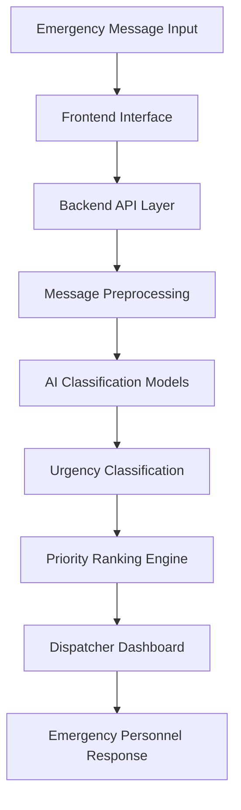

# RapidRelief Architecture Flow

```mermaid
flowchart TD

A[Emergency Message Input]
--> B[Frontend Interface]

B --> C[Backend API Layer]

C --> D[Message Preprocessing]

D --> E[AI Classification Models]

E --> F[Urgency Classification]

F --> G[Priority Ranking Engine]

G --> H[Dispatcher Dashboard]

H --> I[Emergency Personnel Response]
```
